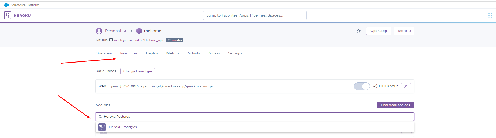
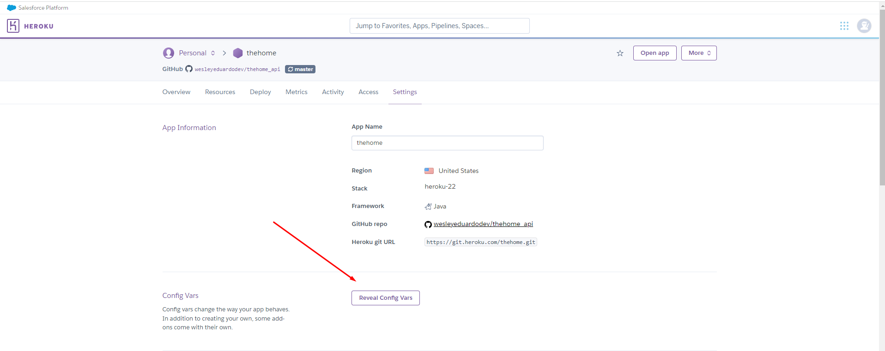

# THE HOME API - Controle de Orçamentos

# **Projeto em Desenvolvimento**

# Design do Sistema (Fase inicial de validação conceitual)

# LINKS GERAIS
- Aplicação Quarkus: https://thehome-3a98079ba9ed.herokuapp.com/
- Swagger: https://thehome-3a98079ba9ed.herokuapp.com/q/swagger-ui/
- Aplicação Angular: https://thehome-web.vercel.app/home
- Projeto Frontend (Angular): https://github.com/wesleyeduardodev/thehome_web

# Comandos básicos para executar o projeto
- Compilação: mvn clean install
- Subir aplicação: ./mvnw compile quarkus:dev
- Dev UI:  http://localhost:8080/q/dev-ui/extensions
- Swagger: http://localhost:8080/q/swagger-ui/
- Executar jar: java -jar target/quarkus-app/quarkus-run.jar
- Conectar máquina EC2: ssh ec2-user@"ip_aqui"
- Copiar jara para EC2: scp ./target/quarkus-app/quarkus-run.jar ec2-user@"ip_aqui":/home/ec2-user

# Tecnologias necessárias para execução do projeto

- Java - Versão 17. Disponível em: https://docs.aws.amazon.com/corretto/latest/corretto-17-ug/downloads-list.html
- Maven - Versão 3.9.4. Disponível em: https://dlcdn.apache.org/maven/maven-3/3.9.4/source/apache-maven-3.9.4-src.zip

# Passos para executar o projeto em ambiente local utilizando linhas de comandos (Ambiente Windows)

- O primeiro passso aqui é ter o Java e o Maven configurados nas variavéis de ambiente do windows.
- Acesse as configurações de variáveis de ambiente
- 
- 
- Na parte de variáveis do sistema, clique em Novo e configure os diretórios onde estão o JAVA e o MAVEN da seguinte forma:
- 
- Faça uma edição no Path para configurar o bin:
- 
- 
- Clique em OK em todas as telas para encerrar a configuração
- Para testar a configuração do Java abra o cmd e digite: **java -version**
- 
- Para testar a configuração do Maven abra o cmd e digite: **mvn**
- 
- Agora vamos executar alguns comandos para iniciar a aplicação
- Abra o diretório raiz do projeto clonado e abra como um terminal do GitBash por exemplo. Link downnload GitBash: https://git-scm.com/downloads
- 
- 
- Execute o comando **mvn clean install** para gerar o build completo da aplicação, inclusive com os testes.
- 
- Devemos ter o seguinte resultado:
- 
- Para finalmente iniciar a aplicação. Execute o seguinte comando: **./mvnw compile quarkus:dev**
- Temos como resultado:
- 
- Utilize o seguinte link acessar o Dashboard do Quarkus: http://localhost:8080
- Link do Swagger http://localhost:8080/q/swagger-ui/
- 

# Passos para executar o projeto em ambiente local utilizando IntelliJ IDEA no idioma inglês

- Clonar o projeto em algum diretório na máquina. (Para essa aplicação foi usado Windows como ambiente de desenvolvimento)
- Baixar e instalar versão gratuita IntelliJ IDEA Ultimate por 30 dias. https://www.jetbrains.com/idea/download/?section=windows
- Ao iniciar a IDE, selecionar a Opção File -> Open
- 
- Procure e selecione o diretório onde o projeto foi clonado:
- 
- Para configurar o Java selecione a opção File -> Project Structure
- 
- Na aba project, opção SDK procure e selecione a SDK do Java 17 presente no diretório da sua máquina
- 
- Para configurar o maven, selecione a opção File -> Settings
- 
- Pesquisar por maven e configure conforme imagem
- 
- Na aba do maven na parte superior da lateral direita, execute o clean e install para baixar as dependências do projeto.
- 
- Após finalizar com sucesso essa ação. na parte superior da lateral direita, clique no botão para executar o projeto:
- 
- Utilize o seguinte link acessar o Dashboard do Quarkus: http://localhost:8080 
- Link do Swagger http://localhost:8080/q/swagger-ui/
-  

# Deploy da aplicação no ambiente Heroku
- Para deploy é preciso configurar alguns arquivo e seu conteúdo no projeto
- Na raiz do projeto criar o arquivo Procfile e inserir o conteúdo: web: java $JAVA_OPTS -jar target/quarkus-app/quarkus-run.jar
- 
- Na raiz do projeto criar o arquivo system.properties e inserir o conteúdo: java.runtime.version=11
- 
- No arquivo application.properties presente no diretório  src/main/resources/application.properties inserir o conteúdo: quarkus.http.port=${PORT:8080}
- 
- Na parte de Deploy selecione a Opção de Conectar ao GitHub
- 
- Mais abaixo clique na opção Deploy Branch selecionando a branch master ou main
- 
- Aguarde o build. Se ocorrer erros o buil irá falhar
- Em caso de Sucesso ficará da seguinte forma:
- 
- Clique em View e a aplicação será exibida
- 

# Criar banco local com o Docker usando Windows

- Intalar o Docker: https://docs.docker.com/desktop/install/windows-install/
- Usar o cmd do Windows para executar os comandos
- Verificar se a instação está ok: docker info
- Baixar Postgres 15: docker pull postgres:15
- Verificar imagem baixada: docker images
- Criar Container para o banco: docker run -d --name postgres15 -p 5432:5432 -e POSTGRES_PASSWORD=root postgres:15
- Verificar Container: docker ps
- Entrar no Container criado: docker exec -it postgres15 bash
- Conectar ao banco: psql -h localhost -U postgres
- Criar banco do projeto: CREATE DATABASE thehome;

# Configurar banco de dados Postgres Heroku
- Na aba Resource do app já criado no Heroku, pesquise por "Heroku Postgres"
- 
- Adicione o Aplicativo
- 
- Entre no aplicativo Datastorages criado
- 
- Na aba Settings, clique em "View Credentials"
- 
- Será exibido os dados de acesso ao banco remoto.
- 
- Agora é preciso configurar as variáveis para a aplicação conectar ao banco
- Na aba Settings do Aplicativo, clicar em "Reveal Config Vars"
- 
- Crie as variáveis(DATABASE_HOST,DATABASE_NAME,DATABASE_PASSWD,DATABASE_PORT,DATABASE_USER) e insira seus dados conforme imagem
- A variável DATABASE_URL já vem configurado por padrão e não precisa ser alterada
- 
- Lembrando que o nome dessas varíavel pode ser qualquer nome desde que esteja de acordo com o definido no arquivo application.properties presente no diretório  src/main/resources/application.properties
- 

# Conectar ao banco usando DataGrip
- 

# Conectar ao banco usando DBeaver
- 